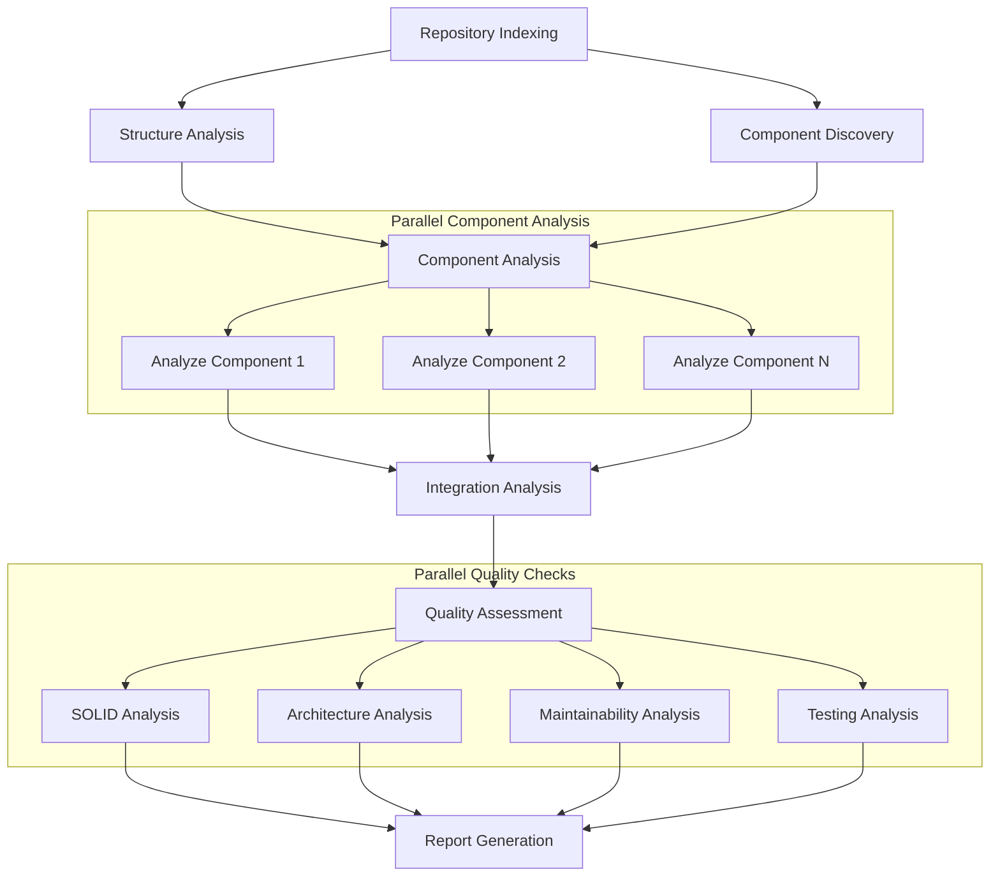

# Project Plan: Codebase Evaluator System

## LangGraph Workflow Design

### Parallel Analysis Pipeline
Using LangGraph to implement a multi-step workflow with parallel execution where possible:



### Workflow Implementation

#### 1. State Management
```python
class AnalysisState(TypedDict):
    repo_url: str
    db: Any  # ChromaDB instance
    structure_analysis: dict
    component_map: dict
    component_analyses: dict
    integration_analysis: dict
    quality_assessments: dict
    reports: dict
    cache: dict
    messages: List[str]
```

#### 2. Parallel Execution Nodes
1. Initial Analysis (parallel):
   ```python
   @node
   def analyze_structure(state: AnalysisState) -> dict:
       """Analyze project structure, directories, files"""
   
   @node
   def discover_components(state: AnalysisState) -> dict:
       """Identify key components and relationships"""
   ```

2. Component Analysis (parallel per component):
   ```python
   @node
   def analyze_component(state: AnalysisState, component_id: str) -> dict:
       """Deep analysis of single component"""
   ```

3. Quality Assessment (parallel per category):
   ```python
   @node
   def assess_solid_principles(state: AnalysisState) -> dict:
       """Evaluate SOLID compliance"""
   
   @node
   def assess_architecture(state: AnalysisState) -> dict:
       """Evaluate architectural patterns"""
   ```

#### 3. Sequential Nodes
```python
@node
def analyze_integration(state: AnalysisState) -> dict:
    """Analyze component interactions"""

@node
def generate_reports(state: AnalysisState) -> dict:
    """Generate final reports"""
```

#### 4. Workflow Configuration
```python
def create_analysis_workflow():
    """Creates parallel analysis workflow"""
    workflow = StateGraph(AnalysisState)
    
    # Add parallel initial analysis
    workflow.add_parallel_nodes(
        "initial_analysis",
        ["analyze_structure", "discover_components"]
    )
    
    # Add dynamic parallel component analysis
    workflow.add_parallel_by_map(
        "component_analysis",
        analyze_component,
        lambda state: state["component_map"]
    )
    
    # Add parallel quality assessment
    workflow.add_parallel_nodes(
        "quality_assessment",
        ["assess_solid", "assess_architecture", 
         "assess_maintainability", "assess_testing"]
    )
    
    # Configure edges
    workflow.set_entry_point("initial_analysis")
    workflow.add_edge("initial_analysis", "component_analysis")
    workflow.add_edge("component_analysis", "analyze_integration")
    workflow.add_edge("analyze_integration", "quality_assessment")
    workflow.add_edge("quality_assessment", "generate_reports")
    
    return workflow.compile()
```

### Rate Limit Management
- Implement token bucket rate limiting
- Track API usage per parallel branch
- Add backoff when limits approached
- Cache results to minimize API calls

### Caching Strategy
1. Persistent Cache:
   - Project structure
   - Component definitions
   - Analysis results
   
2. Memory Cache:
   - Intermediate results
   - Partial analyses
   - Cross-references

## Execution Steps

[x] Create basic repository indexer
[x] Create basic workflow system
[x] Create basic report generation

[ ] Implement Parallel Analysis Pipeline
    [ ] Create state management system
    [ ] Implement parallel analysis nodes
    [ ] Add rate limit handling
    [ ] Create caching system

[ ] Enhance Analysis Capabilities
    [ ] Improve code parsing
    [ ] Add relationship tracking
    [ ] Implement quality metrics
    [ ] Add progress tracking

[ ] Create Report Generation
    [ ] Overview report with diagrams
    [ ] Detailed assessment report
    [ ] Recommendations

[ ] Add Chat UI
    [ ] Basic Streamlit interface
    [ ] Query cached insights
    [ ] Interactive exploration

## Benefits of This Design
1. Efficient use of API calls through parallelization
2. Better handling of large codebases
3. Granular progress tracking
4. Reusable cached insights
5. Scalable to different project sizes
