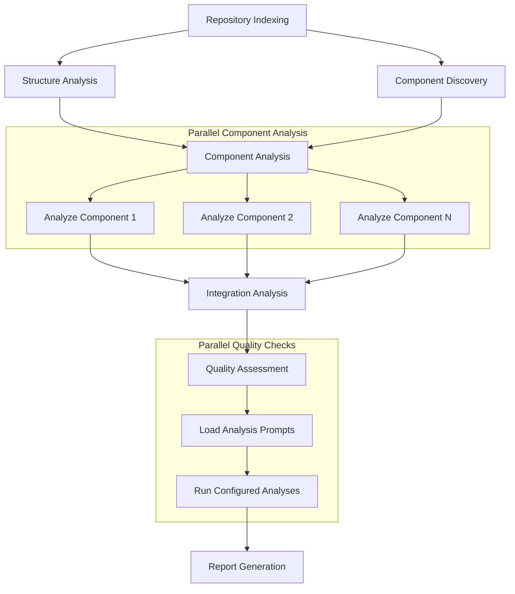

# Project Plan: Codebase Evaluator System

## LangGraph Workflow Design

### Parallel Analysis Pipeline
Using LangGraph to implement a multi-step workflow with parallel execution where possible:



### Configurable Analysis System

The system uses configuration over code to define what to analyze and how to analyze it. This allows for:

1. Flexible Analysis Definition
   - Analysis criteria defined in configuration files
   - Easy to add, remove, or modify analysis types
   - No code changes needed to update analysis criteria

2. Configurable Components
   - Evaluation criteria
   - Analysis prompts

3. Benefits
   - Easy customization per project
   - Reusable analysis patterns
   - Consistent evaluation approach
   - Simple maintenance and updates

### Workflow Implementation

#### 1. State Management
```python
class AnalysisState(TypedDict):
    repo_url: str
    db: Any  # ChromaDB instance
    structure_analysis: dict
    component_map: dict
    component_analyses: dict
    integration_analysis: dict
    quality_assessments: dict
    reports: dict
    cache: dict
    messages: List[str]
    prompt_configs: Dict[str, Any]
```

#### 2. Parallel Execution Nodes
1. Initial Analysis (parallel):
   ```python
   @node
   def analyze_structure(state: AnalysisState) -> dict:
       """Analyze project structure, directories, files"""
   
   @node
   def discover_components(state: AnalysisState) -> dict:
       """Identify key components and relationships"""
   ```

2. Component Analysis (parallel per component):
   ```python
   @node
   def analyze_component(state: AnalysisState, component_id: str) -> dict:
       """Deep analysis of single component"""
   ```

#### 3. Sequential Nodes
```python
@node
def analyze_integration(state: AnalysisState) -> dict:
    """Analyze component interactions"""

@node
def generate_reports(state: AnalysisState) -> dict:
    """Generate final reports"""
```

### Rate Limit Management
- Implement token bucket rate limiting
- Track API usage per parallel branch
- Add backoff when limits approached
- Cache results to minimize API calls

### Caching Strategy
1. Persistent Cache:
   - Project structure
   - Component definitions
   - Analysis results
   - Analysis prompt results
   
2. Memory Cache:
   - Intermediate results
   - Partial analyses
   - Cross-references

## Execution Steps

[x] Create basic repository indexer
[x] Create basic workflow system
[x] Create basic report generation
[ ] Design configurable analysis system
[ ] Implement analysis configuration loading
[ ] Create dynamic analysis execution
[ ] Implement parallel analysis execution
[ ] Create state management system
[ ] Add rate limit handling
[ ] Create caching system
[ ] Improve code parsing
[ ] Add relationship tracking
[ ] Implement quality metrics
[ ] Add progress tracking
[ ] Create overview report with diagrams
[ ] Create detailed assessment report
[ ] Add recommendations generation
[ ] Implement basic Streamlit interface
[ ] Add query system for cached insights
[ ] Create interactive exploration UI

## Benefits of This Design
1. Efficient use of API calls through parallelization
2. Better handling of large codebases
3. Granular progress tracking
4. Reusable cached insights
5. Scalable to different project sizes
6. Configurable analysis criteria
7. Easy to add/remove analysis principles
8. Maintainable through configuration over code
9. Flexible prompt customization
10. Project-specific analysis tuning
